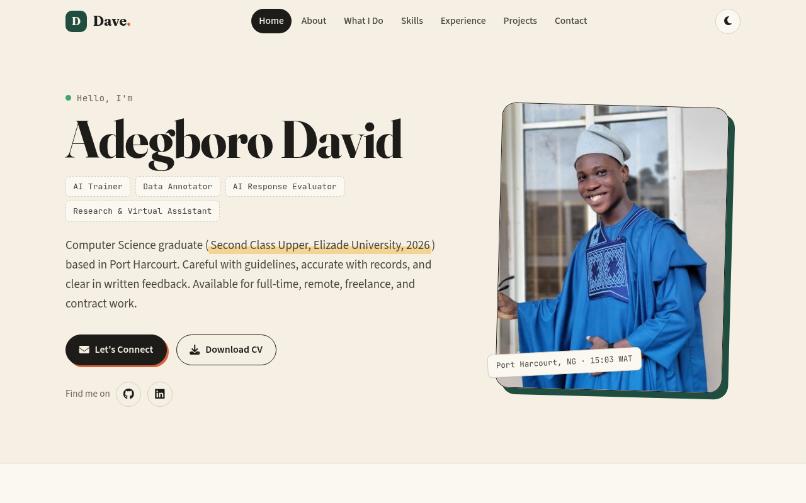
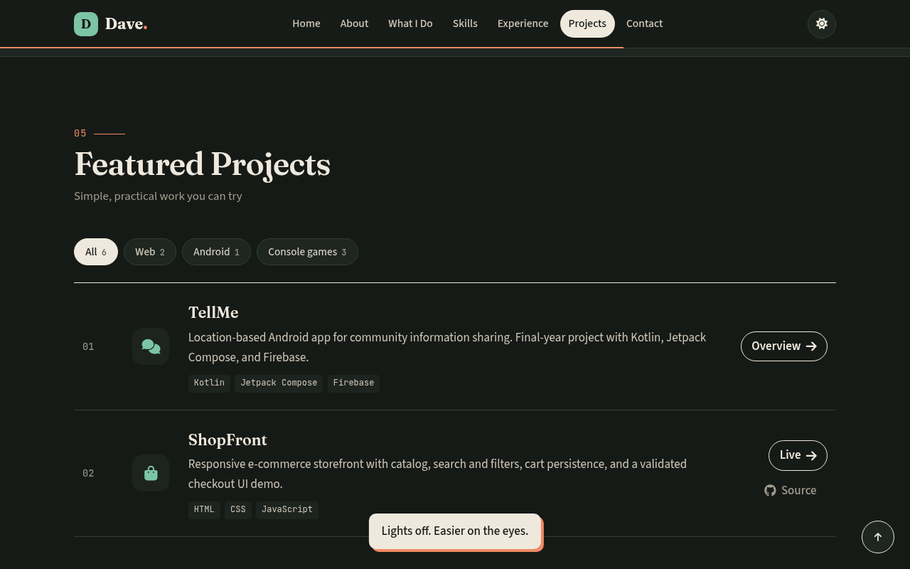
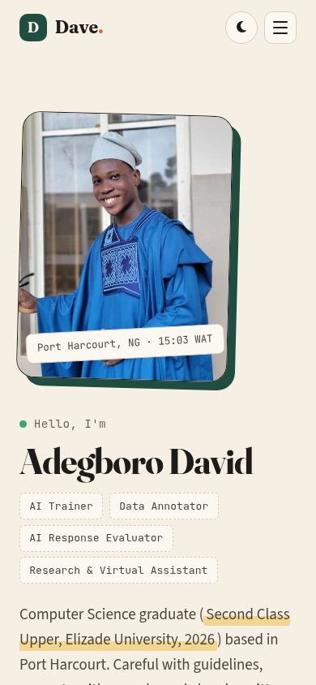

# Dave · Portfolio

This is my personal site: who I am, what I do (AI training, data annotation, response evaluation, research, and virtual assistance), where I've worked, and a few small projects you can try right in the browser.

**Live site:** https://dave-4u.github.io/



| Dark theme | On a phone |
|---|---|
|  |  |

## What's on the page

- A "field notes" design: warm paper, ink, forest green, and terracotta highlights that look like annotation marks (hover the highlighted phrases)
- Light and dark themes (press `T`). It remembers your choice and follows your system setting by default.
- A numbered section index, a reading-progress bar, and active-section highlighting in the nav
- Experience shown as a timeline, and projects as a filterable list (Web / Android / Console games)
- One-click copy for my email and phone, and a contact form that opens your email app with everything filled in, with friendly validation
- Keyboard shortcuts: `1`–`6` jump to a section, `T` theme, `C` copy email, `?` show all shortcuts
- Responsive, visible focus states, a skip link, and support for reduced motion

## Projects hosted here

| Project | Live | Source |
|---|---|---|
| Kobo · Expense Tracker | [/projects/expense-tracker/](https://dave-4u.github.io/projects/expense-tracker/) | [expense-tracker](https://github.com/Dave-4u/expense-tracker) |
| ShopFront | [/projects/shopfront/](https://dave-4u.github.io/projects/shopfront/) | [shopfront](https://github.com/Dave-4u/shopfront) |
| Hot or Cold (number guessing) | [/projects/number-guessing/](https://dave-4u.github.io/projects/number-guessing/) | [Python](https://github.com/Dave-4u/python-number-guessing) · [Java](https://github.com/Dave-4u/java-number-guessing) |
| Rock Paper Scissors | [/projects/rock-paper-scissors/](https://dave-4u.github.io/projects/rock-paper-scissors/) | [C#](https://github.com/Dave-4u/csharp-rock-paper-scissors) |
| TellMe (overview) | [/projects/tellme/](https://dave-4u.github.io/projects/tellme/) | private |

## Layout

```
index.html            the page
css/styles.css        theme (light + dark)
css/sub.css           project overview pages
js/main.js            theme, nav, filters, shortcuts, copy, form
assets/               CV, photo, favicon
projects/             live demo copies of the projects above
docs/                 README screenshots
```

## Local preview

```bash
python3 -m http.server 8000   # then open http://localhost:8000/
```

No build step. GitHub Pages serves `main` directly.
